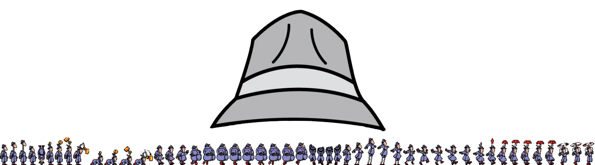
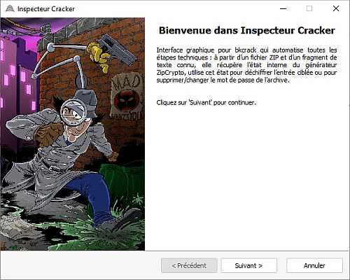
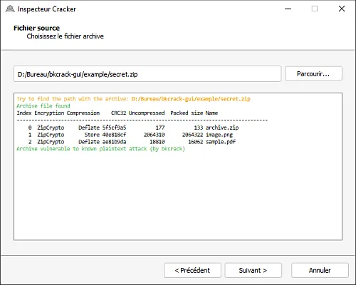
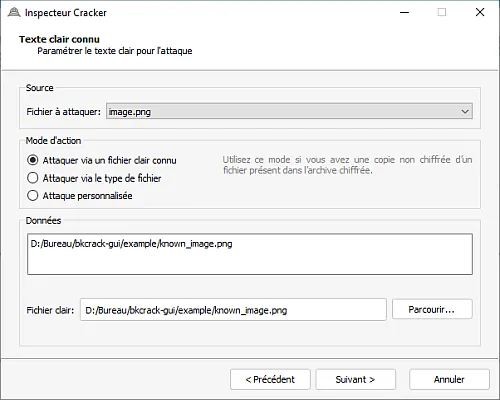
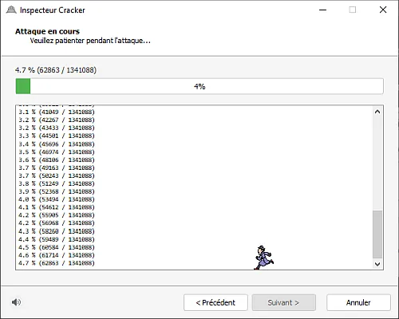
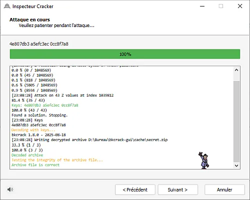

### Inspecteur Cracker

**bkcrack** est un utilitaire en ligne de commande qui implémente l’attaque connue de Biham & Kocher contre le chiffrement ZipCrypto (legacy PKWARE) : à partir d’un couple texte chiffré / texte connu (au moins 12 octets, dont 8 contigus), il récupère l’état interne du générateur de flux, permet de déchiffrer les données, de retrouver le mot de passe ou de recréer l’archive sans chiffrement. **Inspecteur Cracker** est donc l'interface graphique pensée pour rendre bkcrack immédiatement accessible à tous: simple, visuelle et explicative.

---

### Installation

```
git clone https://github.com/Game-K-Hack/bkcrack-gui.git
pip install -r requirements.txt
python main.py
```

---

### Démonstration



Sélection de l’archive cible.



Paramétrage des éléments connus.



Attaque en cours — profitez de la musique d’**Inspecteur Gadget** 🎵



Et voilà, c'est simple comme bonjour



### Exemple

Des exemples d'utilisation du logiciel sont disponibles [ici](./example/README.md)

---

### Configuration

Pour ajouter vos propres signatures de fichiers, éditez `headers.yml` en respectant la structure suivante :

```yaml
<nom_unique_du_type_de_fichier>:
  name: <nom lisible du type de fichier>
  extension: <extension>
  magic_number: <numéro magique identifiant le fichier (hex ou décimal)>
  content:
    - name: <nom_de_la_position>
      position: <position_dans_le_fichier>
      hex: <données_en_hexadécimal>
```

> Les champs marqués d’un astérisque `*` sont obligatoires dans la logique applicative (ex. `name`, `extension`, `magic_number`). Adaptez les positions et la valeur hexadécimale en fonction du type de fichier.

---

### Contribution

Contributions bienvenues !  
Pour proposer une amélioration, ouvrir une issue ou soumettre une pull request sur le dépôt GitHub.

### Prochaine étape

- [ ] Traduire l'interface dans d'autre langue
- [ ] Ajouter plus de headers dans le Yaml
- [ ] Faire en sorte que si le programme bkcrack n'est pas installé alors ne pas pouvoir lancer une attaque
- [ ] Faciliter l'attaque de fichier deflated dans un zip chiffré
- [ ] Ajouter à la fin de l'attaque une option pour cracker le mot de passe du zip
- [ ] Ajouter un cache avec les clées de chaque zip déchiffré afin de ne pas réattendre
  - [ ] Vérifier que c'est bien le même zip (via un hash) et vérifier que les clées déchiffre bien le zip  
  - [ ] (a réfléchir) partager le cache des clées afin de faire gagné du temps entre utilisateur
