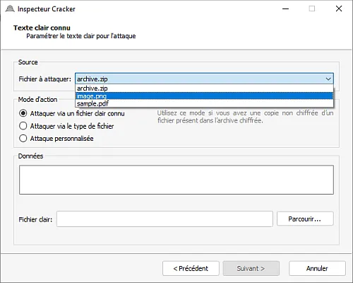
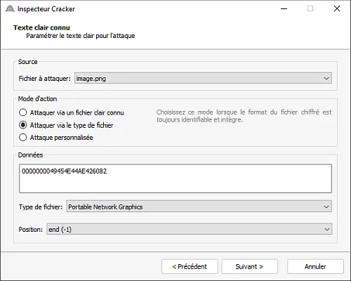
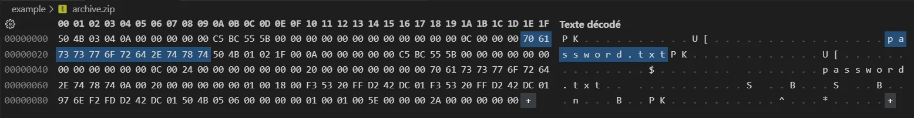
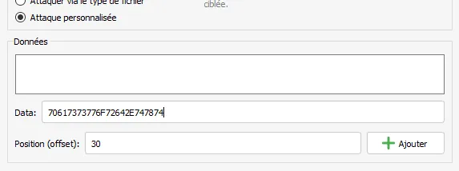
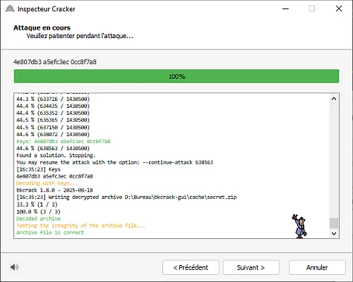

**Attention** la compression des fichiers est importante. Si le fichier n'est pas compressé (store), alors il est plus simple de cracker le zip que s'il est compressé (deflated).

# Exemple (Compression: Store)

Pour vous entraîner, j'ai zippé et chiffré une archive (sans compression) avec les fichiers suivants :
```
secret_store.zip
  ├─ archive.zip
  │    └─ password.txt
  ├─ image.webp
  └─ sample.pdf
```
Oui, vous ne pouvez pas savoir que `archive.zip` contient le fichier `password.txt`, c'est cadeau.

## Fichier clair connu

Dans le cas où vous détenez l'un des fichiers non chiffrés de l'archive, vous pouvez l'utiliser pour cracker le zip chiffré.

Sélectionnez l'archive à cracker


Sélectionnez le fichier cible à attaquer dans l'archive



Sélectionnez le fichier connu (fichier en clair) qui correspond au fichier cible de l'archive


Et voilà, vous venez de trouver les clés pour déchiffrer l'archive


## Attaque via la signature du fichier

Cette attaque se base sur les signatures / magic numbers des fichiers. L'interface propose certaines signatures de fichiers mais pas toutes (à vous de faire vos recherches). Aussi, les signatures peuvent être courtes (inférieures à 12 octets) ; or il faut un minimum de 12 octets pour que l'attaque fonctionne.

Pour l'exemple, on peut attaquer l'image de type PNG avec la signature de fin.



## Attaque avancée

Ce mode vous permet de saisir librement les données en clair du fichier. Pour l'exemple je vais attaquer l'archive via le ZIP `archive.zip` qui se trouve à l'intérieur de l'archive chiffrée `secret_store.zip`. On sait que `archive.zip` contient le fichier `password.txt`. Donc dans un premier temps je crée un fichier texte vide portant le nom `password.txt` que je zippe avec l'algorithme `ZipCrypto` disponible dans 7-Zip. Ensuite j'ouvre le zip en hexadécimal et je repère le nom du fichier.



On peut voir que le nom du fichier commence en `E1`, soit en décimal `30` (notre position/offset). On voit aussi que le nom du fichier en hexadécimal est : `70 61 73 73 77 6F 72 64 2E 74 78 74`, soit nos données. Plus qu'à rentrer les infos dans **Inspecteur Cracker**, en sélectionnant le bon fichier à attaquer `archive.zip` et en n'oubliant pas de cliquer sur "Ajouter" avant de faire "Suivant".



Puis attendre tout en appréciant la musique d'Inspecteur Gadget


Et voilà, c'est déchiffré :



# Exemple (Compression: Deflated)

*Bientôt*
