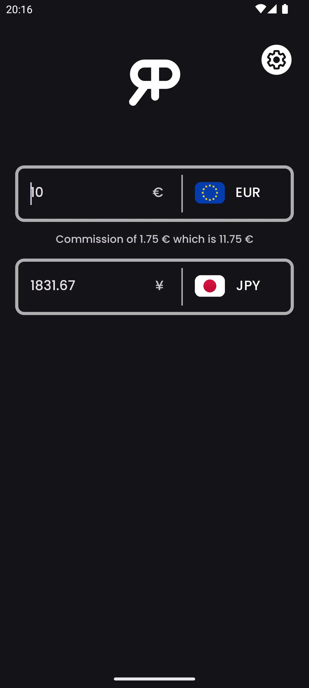
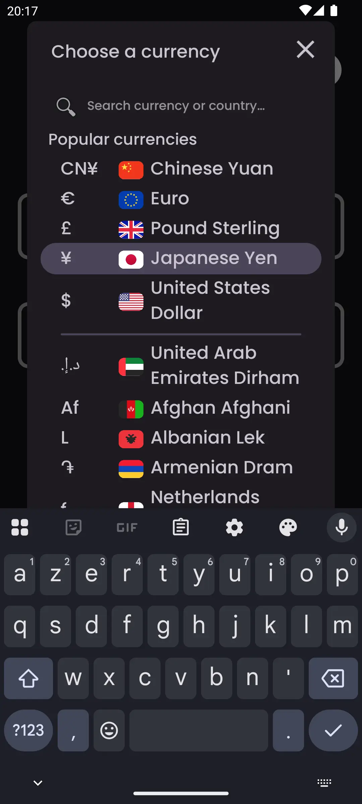
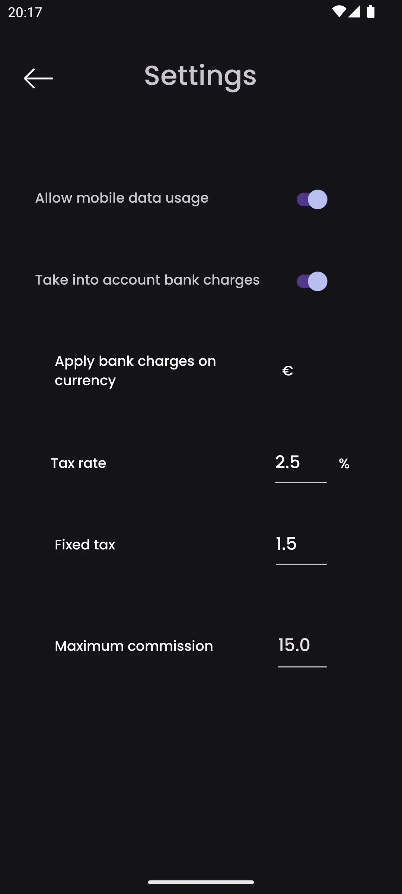
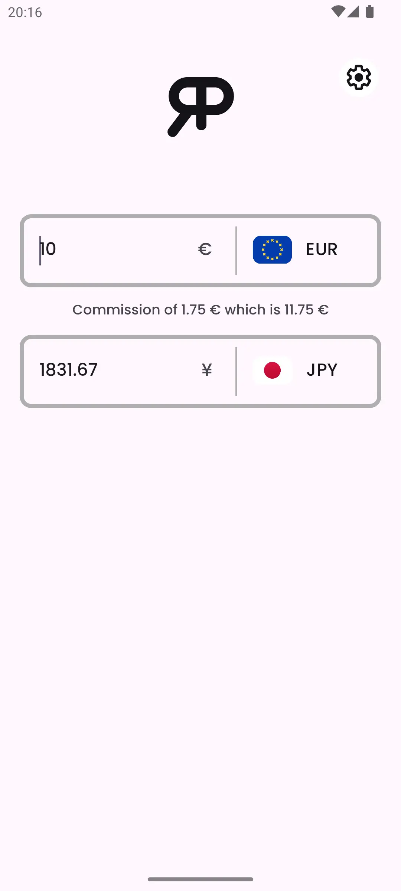

    

<h3 align="center">RealPrice</h3>

<i>by</i> <b><a href="https://github.com/MathieuMarthy">MathieuMarthy</a></b> <i>&</i> <b><a href="https://github.com/Game-K-Hack">Game K</a></b>

 

  
  
  

  <a href="#description">Description</a> •
  <a href="#how-it-works-">How it works ?</a> •
  <a href="#configuration">Configuration</a>

 

    
    

 
 

    <a href="./documentation/README.fr.md">🇫🇷 Français</a> |
    <b>🇬🇧 English</b> |
    <a href="./documentation/README.kr.md">🇰🇷 한국어</a> |
    <a href="./documentation/README.jp.md">🇯🇵 日本語</a> |
    <a href="./documentation/README.cn.md">🇨🇳 中文</a> |
    <a href="./documentation/README.it.md">🇮🇹 Italiano</a> |
    <a href="./documentation/README.es.md">🇪🇸 Español</a> |
    <a href="./documentation/README.ru.md">🇷🇺 Русский</a> |
    <a href="./documentation/README.de.md">🇩🇪 Deutsch</a>

## Description

RealPrice is a currency conversion app for travelers who want to know the real cost of items in a foreign currency. With RealPrice, you can easily compare exchange rates between two currencies and adjust the commission percentage charged by your bank during international transactions. This feature allows you to calculate the final price of an item or service, taking into account not only the exchange rate, but also the associated banking fees. The app automatically updates as soon as you are connected to the Internet, ensuring always accurate and up-to-date conversions. Never travel again without RealPrice! Be sure to know exactly how much you'll spend in your currency of choice, accounting for your bank's conversion fees. <a href="https://github.com/MathieuMarthy/RealPrice/releases/latest">Download RealPrice</a> today and travel with peace of mind.
 
 
 

## 💡How it works ? 

RealPrice operates on a simple yet effective principle to provide you with accurate and realistic currency conversions:

### Real-time conversion
- The app features **200+ global currencies** with their current exchange rates
- Exchange data updates automatically as soon as you are connected to the Internet
- In offline mode, the app uses the latest downloaded rates with indication of the last update date

### Interface
- **Two input fields** allow instant conversion in both directions
- **Easy currency selection** via a dropdown menu with flags and symbols
- **Smart search bar**: Find currencies instantly by typing currency codes (EUR, USD), currency
  names (Euro, Dollar), or country names (France, United States). The search is accent-insensitive,
  so typing "egypte" will find "Égypte"
- **Bidirectional conversion**: type an amount in any field to see automatic conversion
- **Quick exchange**: if you select a currency already in use, the two currencies automatically swap

### Others features
- **Adaptive dark/light mode**
- **Multilingual support** (9 languages available)
 

  
  
  
  

 
 

## ⚙️ Configuration

There are several ways to configure the RealPrice app to meet your specific needs. Here's a detailed guide to the available options:

### Data management
You can enable or disable automatic exchange rate updates via your mobile data. Disabled by default to save your data.

### Banking fees configuration
Enable this option to get the real cost of your international transactions:

#### Fee settings (active only if banking fees are enabled):

- **Commission rate (%)**: Percentage charged by your bank on each transaction
  - *Example: 2.5% means that for a €100 purchase, you'll pay €2.50 in commission*

- **Fixed fees**: Fixed amount added to each transaction, regardless of the converted amount
  - *Example: €1.50 fixed fees will be added to each payment, whether you buy for €10 or €1000*

- **Fee application currency**: Select the currency in which your bank charges commissions
  - *Important: Fees only apply when converting to this currency*

- **Maximum commission**: Banking fees cap (0 = no limit)
  - *Example: 15.00 to limit fees to €15 maximum per transaction*

###  How to configure your banking fees?

1. Check your bank's rate conditions for foreign operations
2. Enable **"Take into account banking fees"**
3. Enter the **commission rate** (generally between 1% and 3%)
4. Add **fixed fees** if your bank applies them
5. Select the **billing currency** (often your local currency)
6. Set a **cap** if your bank offers one

### Default currencies 
The app automatically remembers your last two currencies used for quick access on next startup.

## Available languages:

- 🇫🇷 Français
- 🇬🇧 English
- 🇰🇷 한국어
- 🇯🇵 日本語
- 🇨🇳 中文
- 🇮🇹 Italiano
- 🇪🇸 Español
- 🇷🇺 Русский
- 🇩🇪 Deutsch

_If you want the application to be translated into your language or there is a translation problem in the README, let us know by leaving a <a href="https://github.com/MathieuMarthy/RealPrice/issues/1">message in Issues</a>._
