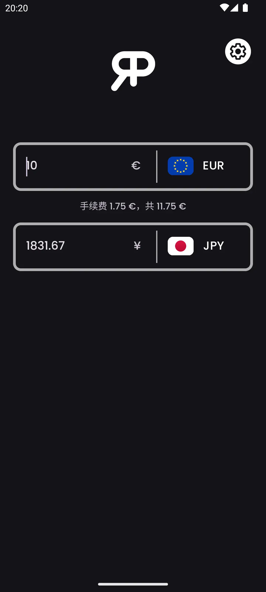
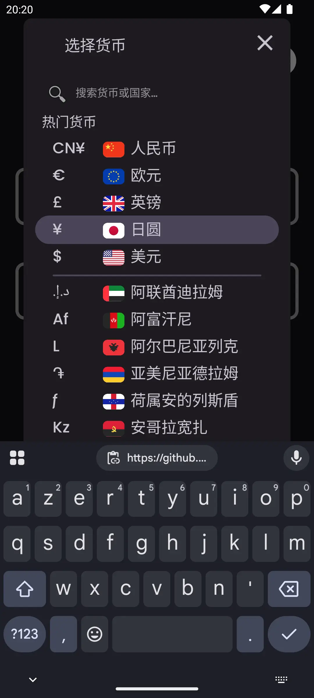
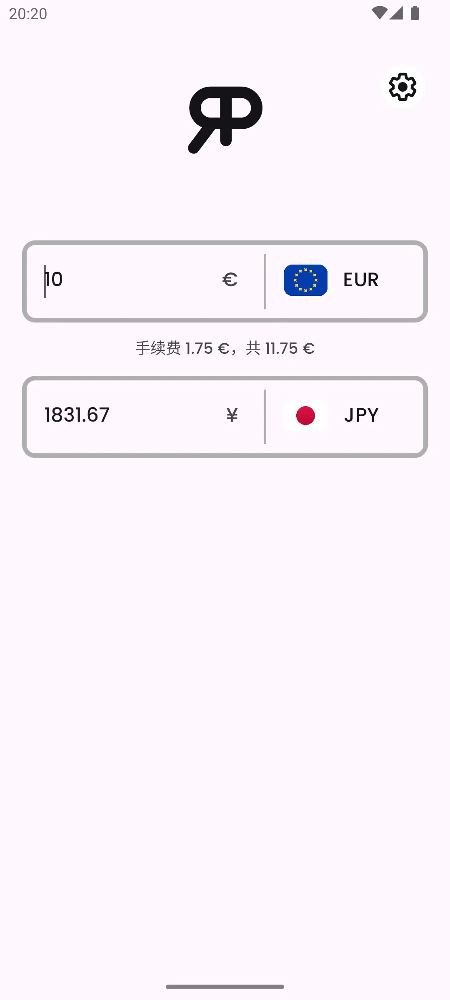

    

<h3 align="center">RealPrice</h3>

<i>由</i> <b><a href="https://github.com/MathieuMarthy">MathieuMarthy</a></b> <i>和</i> <b><a href="https://github.com/Game-K-Hack">Game K</a></b> <i>创建</i>

 

  
  
  

  <a href="#描述">描述</a> •
  <a href="#如何工作-">如何工作 ?</a> •
  <a href="#配置">配置</a>

 

    
    

 
 

    <a href="./README.fr.md">:fr: Français</a> |
    <a href="../README.md">:uk: English</a> |
    <a href="./README.kr.md">:kr: 한국어</a> |
    <a href="./README.jp.md">:jp: 日本語</a> |
    <b>:cn: 中文</b> |
    <a href="./README.it.md">:it: Italiano</a> |
    <a href="./README.es.md">:es: Español</a> |
    <a href="./README.ru.md">:ru: Русский</a> |
    <a href="./README.de.md">:de: Deutsch</a>

## 描述

RealPrice是一款适合想要了解外币商品真实成本的旅行者的货币转换应用。使用RealPrice，您可以轻松比较两种货币之间的汇率，并调整银行在国际交易时收取的佣金百分比。此功能让您可以计算商品或服务的最终价格，不仅考虑汇率，还考虑相关的银行费用。该应用在您连接到互联网时会自动更新，确保始终准确和最新的转换。不要再在没有RealPrice的情况下旅行了！确保知道您在所选货币中的确切支出，考虑到银行的转换费用。立即<a href="https://github.com/MathieuMarthy/RealPrice/releases/latest">下载RealPrice</a>，安心旅行。
 
 
 

## 💡如何工作 ?

RealPrice基于简单而有效的原理运作，为您提供准确和现实的货币转换：

### 实时转换
- 应用程序提供**200多种全球货币**及其当前汇率
- 一旦连接到互联网，汇率数据会自动更新
- 在离线模式下，应用使用最新下载的汇率，并显示最后更新日期

### 界面
- **两个输入字段**允许双向即时转换
- 通过带有国旗和符号的下拉菜单**轻松选择货币**
- **智能搜索栏**
  ：通过输入货币代码（EUR、USD）、货币名称（欧元、美元）或国家名称（中国、美国）即时查找货币。搜索忽略重音符号，因此输入"
  埃及"也能找到"埃及"
- **双向转换**：在任何字段中输入金额即可看到自动转换
- **快速交换**：如果您选择已在使用的货币，两种货币会自动交换

### 其他功能
- **自适应深色/浅色模式**
- **多语言支持**（支持9种语言）
 

  
    
    
    

 
 

## ⚙️ 配置

有几种方法可以配置RealPrice应用以满足您的特定需求。以下是可用选项的详细指南：

### 数据管理
您可以启用或禁用通过移动数据自动更新汇率。默认禁用以节省您的数据。

### 银行费用配置
启用此选项以获得国际交易的真实成本：

#### 费用设置（仅在启用银行费用时激活）：

- **佣金率 (%)**: 银行对每笔交易收取的百分比
  - *示例：2.5%意味着购买100€时，您将支付2.50€的佣金*

- **固定费用**: 添加到每笔交易的固定金额，无论转换金额如何
  - *示例：1.50€的固定费用将添加到每次付款中，无论您购买10€还是1000€*

- **费用适用货币**: 选择银行收取佣金的货币
  - *重要：费用仅在转换为此货币时适用*

- **最大佣金**: 银行费用上限（0 = 无限制）
  - *示例：15.00将费用限制为每笔交易最多15€*

### 如何配置您的银行费用？

1. 查看您银行的海外业务费率条件
2. 启用**"考虑银行费用"**
3. 输入**佣金率**（通常在1%到3%之间）
4. 如果您的银行适用，添加**固定费用**
5. 选择**计费货币**（通常是您的本地货币）
6. 如果您的银行提供，设置**上限**

### 默认货币
应用会自动记住您最后使用的两种货币，以便下次启动时快速访问。

## 可用语言:

- :fr: Français
- :uk: English
- :kr: 한국어
- :jp: 日本語
- :cn: 中文
- :it: Italiano
- :es: Español
- :ru: Русский
- :de: Deutsch

_如果您希望应用程序翻译成您的语言或README中存在翻译问题，请在<a href="https://github.com/MathieuMarthy/RealPrice/issues/1">Issues中留言</a>告诉我们。_
