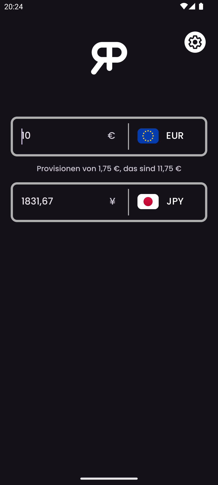
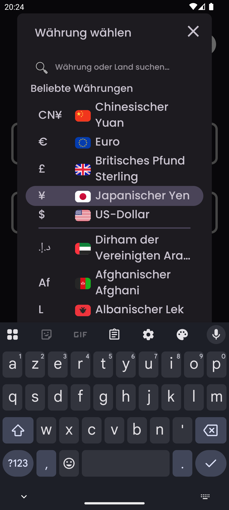
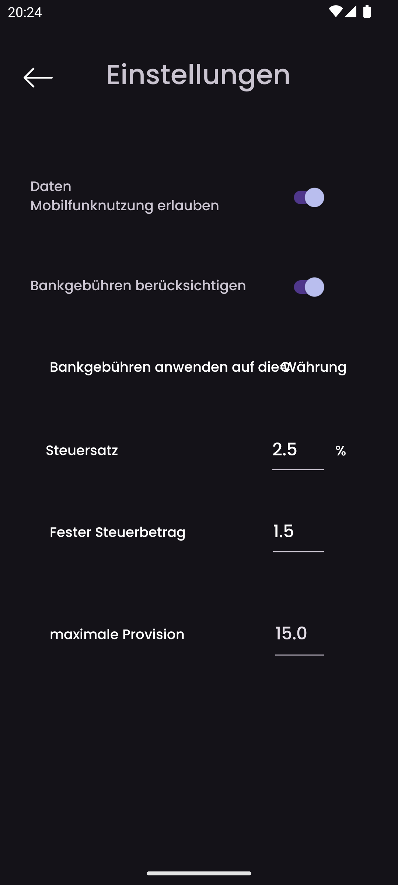
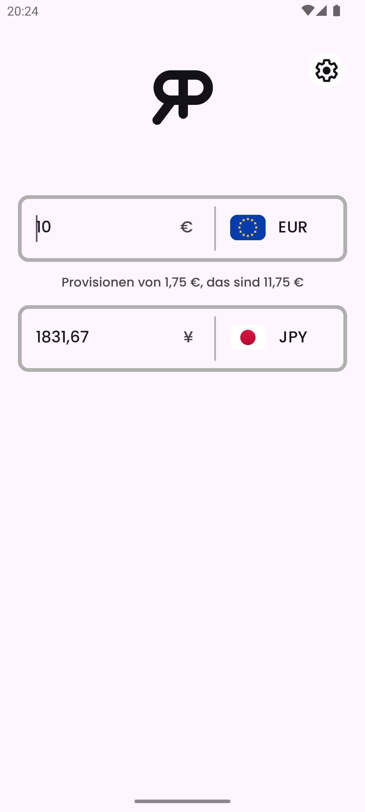

    

<h3 align="center">RealPrice</h3>

<i>Von</i> <b><a href="https://github.com/MathieuMarthy">MathieuMarthy</a></b> <i>und</i> <b><a href="https://github.com/Game-K-Hack">Game K</a></b>

 

  
  
  

  <a href="#beschreibung">Beschreibung</a> •
  <a href="#wie-funktioniert-es-">Wie funktioniert es ?</a> •
  <a href="#konfiguration">Konfiguration</a>

 

    
    

 
 

    <a href="./README.fr.md">:fr: Français</a> |
    <a href="../README.md">:uk: English</a> |
    <a href="./README.kr.md">:kr: 한국어</a> |
    <a href="./README.jp.md">:jp: 日本語</a> |
    <a href="./README.cn.md">:cn: 中文</a> |
    <a href="./README.it.md">:it: Italiano</a> |
    <a href="./README.es.md">:es: Español</a> |
    <a href="./README.ru.md">:ru: Русский</a> |
    <b>:de: Deutsch</b>

## Beschreibung

RealPrice ist eine Währungsumrechnung-App für Reisende, die die echten Kosten von Artikeln in einer Fremdwährung wissen möchten. Mit RealPrice können Sie einfach Wechselkurse zwischen zwei Währungen vergleichen und den Provisionsprozentsatz anpassen, den Ihre Bank bei internationalen Transaktionen erhebt. Diese Funktion ermöglicht es Ihnen, den finalen Preis eines Artikels oder einer Dienstleistung zu berechnen, wobei nicht nur der Wechselkurs, sondern auch die damit verbundenen Bankgebühren berücksichtigt werden. Die App aktualisiert sich automatisch, sobald Sie mit dem Internet verbunden sind, und gewährleistet so immer präzise und aktuelle Umrechnungen. Reisen Sie nie wieder ohne RealPrice! Seien Sie sicher, genau zu wissen, wie viel Sie in Ihrer gewählten Währung ausgeben werden, unter Berücksichtigung der Umrechnungsgebühren Ihrer Bank. <a href="https://github.com/MathieuMarthy/RealPrice/releases/latest">Laden Sie RealPrice</a> noch heute herunter und reisen Sie sorglos.
 
 
 

## 💡Wie funktioniert es ?

RealPrice funktioniert nach einem einfachen, aber effektiven Prinzip, um Ihnen genaue und realistische Währungsumrechnungen zu bieten:

### Echtzeitumrechnung
- Die App verfügt über **mehr als 200 globale Währungen** mit ihren aktuellen Wechselkursen
- Wechselkursdaten aktualisieren sich automatisch, sobald Sie mit dem Internet verbunden sind
- Im Offline-Modus nutzt die App die zuletzt heruntergeladenen Kurse mit Anzeige des letzten Aktualisierungsdatums

### Benutzeroberfläche
- **Zwei Eingabefelder** ermöglichen sofortige Umrechnung in beide Richtungen
- **Einfache Währungsauswahl** über ein Dropdown-Menü mit Flaggen und Symbolen
- **Intelligente Suchleiste**: Finden Sie Währungen sofort durch Eingabe von Währungscodes (EUR,
  USD), Währungsnamen (Euro, Dollar) oder Ländernamen (Deutschland, Vereinigte Staaten). Die Suche
  ignoriert Akzente, sodass die Eingabe von "agypten" "Ägypten" findet
- **Bidirektionale Umrechnung**: Tippen Sie einen Betrag in ein beliebiges Feld ein, um die automatische Umrechnung zu sehen
- **Schneller Wechsel**: Wenn Sie eine bereits verwendete Währung auswählen, tauschen die beiden Währungen automatisch

### Weitere Funktionen
- **Adaptiver Dunkel-/Hellmodus**
- **Mehrsprachiger Support** (9 Sprachen verfügbar)
 

  
  
  
  

 
 

## ⚙️ Konfiguration

Es gibt mehrere Möglichkeiten, die RealPrice-App so zu konfigurieren, dass sie Ihren spezifischen Bedürfnissen entspricht. Hier ist eine detaillierte Anleitung zu den verfügbaren Optionen:

### Datenverwaltung
Sie können automatische Wechselkurs-Updates über Ihre mobilen Daten aktivieren oder deaktivieren. Standardmäßig deaktiviert, um Ihre Daten zu sparen.

### Bankgebühren-Konfiguration
Aktivieren Sie diese Option, um die echten Kosten Ihrer internationalen Transaktionen zu erhalten:

#### Gebühreneinstellungen (nur aktiv, wenn Bankgebühren aktiviert sind):

- **Provisionssatz (%)**: Von Ihrer Bank erhobener Prozentsatz pro Transaktion
  - *Beispiel: 2,5% bedeutet, dass Sie bei einem Kauf von 100€ 2,50€ Provision zahlen*

- **Feste Gebühren**: Fester Betrag, der zu jeder Transaktion hinzugefügt wird, unabhängig vom umgerechneten Betrag
  - *Beispiel: 1,50€ feste Gebühren werden zu jeder Zahlung hinzugefügt, egal ob Sie für 10€ oder 1000€ kaufen*

- **Gebühren-Anwendungswährung**: Wählen Sie die Währung, in der Ihre Bank Provisionen berechnet
  - *Wichtig: Gebühren gelten nur bei der Umrechnung in diese Währung*

- **Maximale Provision**: Obergrenze für Bankgebühren (0 = keine Begrenzung)
  - *Beispiel: 15,00 um die Gebühren auf maximal 15€ pro Transaktion zu begrenzen*

### Wie konfigurieren Sie Ihre Bankgebühren?

1. Überprüfen Sie die Tarifbedingungen Ihrer Bank für Auslandsgeschäfte
2. Aktivieren Sie **"Bankgebühren berücksichtigen"**
3. Geben Sie den **Provisionssatz** ein (in der Regel zwischen 1% und 3%)
4. Fügen Sie **feste Gebühren** hinzu, falls Ihre Bank diese erhebt
5. Wählen Sie die **Abrechnungswährung** (oft Ihre lokale Währung)
6. Setzen Sie eine **Obergrenze**, falls Ihre Bank eine anbietet

### Standardwährungen
Die App merkt sich automatisch Ihre letzten beiden verwendeten Währungen für schnellen Zugriff beim nächsten Start.

## Verfügbare Sprachen:

- :fr: Français
- :uk: English
- :kr: 한국어
- :jp: 日本語
- :cn: 中文
- :it: Italiano
- :es: Español
- :ru: Русский
- :de: Deutsch

_Wenn Sie möchten, dass die Anwendung in Ihre Sprache übersetzt wird oder es ein Übersetzungsproblem im README gibt, lassen Sie es uns wissen, indem Sie eine <a href="https://github.com/MathieuMarthy/RealPrice/issues/1">Nachricht in den Issues</a> hinterlassen._
