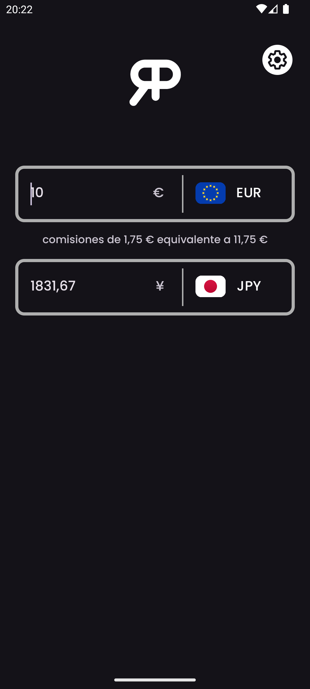
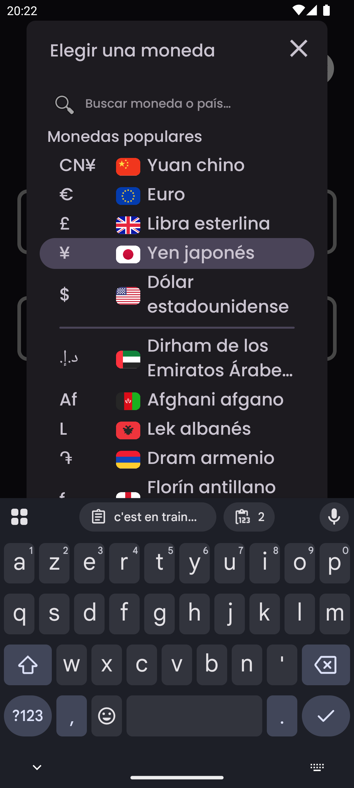
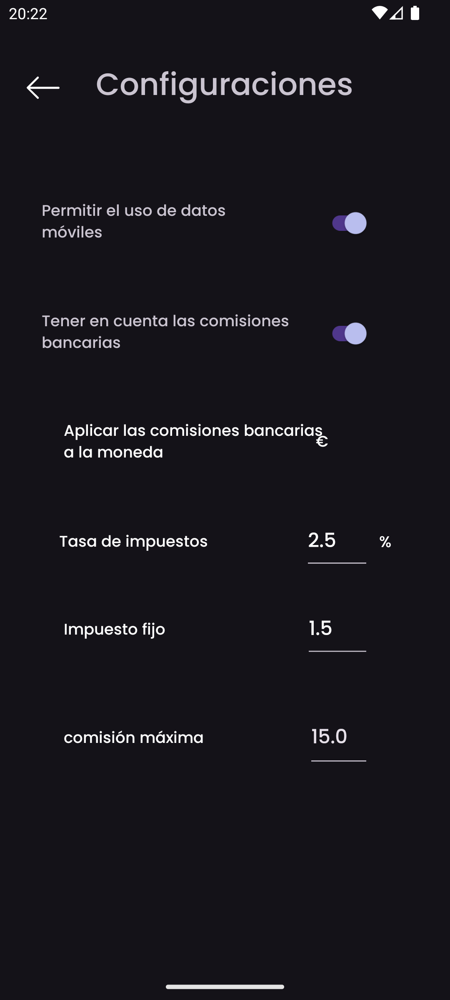
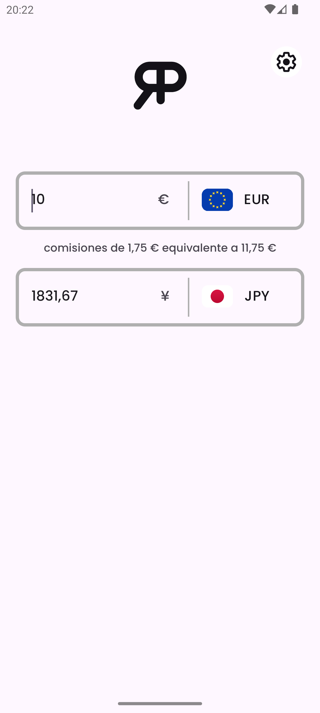

    

<h3 align="center">RealPrice</h3>

<i>por</i> <b><a href="https://github.com/MathieuMarthy">MathieuMarthy</a></b> <i>y</i> <b><a href="https://github.com/Game-K-Hack">Game K</a></b>

 

  
  
  

  <a href="#descripción">Descripción</a> •
  <a href="#cómo-funciona-">¿Cómo funciona ?</a> •
  <a href="#configuración">Configuración</a>

 

    
    

 
 

    <a href="./README.fr.md">:fr: Français</a> |
    <a href="../README.md">:uk: English</a> |
    <a href="./README.kr.md">:kr: 한국어</a> |
    <a href="./README.jp.md">:jp: 日本語</a> |
    <a href="./README.cn.md">:cn: 中文</a> |
    <a href="./README.it.md">:it: Italiano</a> |
    <b>:es: Español</b> |
    <a href="./README.ru.md">:ru: Русский</a> |
    <a href="./README.de.md">:de: Deutsch</a>

## Descripción

RealPrice es una aplicación de conversión de divisas para viajeros que quieren conocer el costo real de los artículos en moneda extranjera. Con RealPrice, puedes comparar fácilmente los tipos de cambio entre dos monedas y ajustar el porcentaje de comisión que tu banco cobra durante las transacciones internacionales. Esta función te permite calcular el precio final de un artículo o servicio, considerando no solo el tipo de cambio, sino también las comisiones bancarias asociadas. La aplicación se actualiza automáticamente tan pronto como te conectas a Internet, garantizando conversiones siempre precisas y actualizadas. ¡No viajes nunca más sin RealPrice! Asegúrate de saber exactamente cuánto gastarás en tu moneda de elección, considerando las comisiones de conversión de tu banco. <a href="https://github.com/MathieuMarthy/RealPrice/releases/latest">Descarga RealPrice</a> hoy mismo y viaja con tranquilidad.
 
 
 

## 💡¿Cómo funciona ?

RealPrice funciona según un principio simple pero efectivo para brindarte conversiones de divisas precisas y realistas:

### Conversión en tiempo real
- La aplicación cuenta con **más de 200 monedas globales** con sus tipos de cambio actuales
- Los datos de cambio se actualizan automáticamente tan pronto como te conectas a Internet
- En modo sin conexión, la aplicación utiliza las últimas tasas descargadas con indicación de la fecha de última actualización

### Interfaz
- **Dos campos de entrada** permiten conversión instantánea en ambas direcciones
- **Selección fácil de monedas** a través de un menú desplegable con banderas y símbolos
- **Barra de búsqueda inteligente**: Encuentra monedas instantáneamente escribiendo códigos de
  moneda (EUR, USD), nombres de monedas (Euro, Dólar), o nombres de países (España, Estados Unidos).
  La búsqueda ignora acentos, por lo que escribir "egipto" encontrará "Egipto"
- **Conversión bidireccional**: escribe una cantidad en cualquier campo para ver la conversión automática
- **Intercambio rápido**: si seleccionas una moneda ya en uso, las dos monedas se intercambian automáticamente

### Otras funciones
- **Modo oscuro/claro adaptativo**
- **Soporte multiidioma** (9 idiomas disponibles)
 

  
  
  
  

 
 

## ⚙️ Configuración

Hay varias formas de configurar la aplicación RealPrice para satisfacer tus necesidades específicas. Aquí tienes una guía detallada de las opciones disponibles:

### Gestión de datos
Puedes activar o desactivar las actualizaciones automáticas de tipos de cambio a través de tus datos móviles. Desactivado por defecto para ahorrar tus datos.

### Configuración de comisiones bancarias
Activa esta opción para obtener el costo real de tus transacciones internacionales:

#### Configuración de comisiones (activa solo si las comisiones bancarias están habilitadas):

- **Tasa de comisión (%)**: Porcentaje cobrado por tu banco en cada transacción
  - *Ejemplo: 2.5% significa que por una compra de 100€, pagarás 2.50€ de comisión*

- **Comisiones fijas**: Cantidad fija añadida a cada transacción, independientemente del monto convertido
  - *Ejemplo: 1.50€ de comisiones fijas se añadirán a cada pago, ya sea que compres por 10€ o 1000€*

- **Moneda de aplicación de comisiones**: Selecciona la moneda en la que tu banco cobra las comisiones
  - *Importante: Las comisiones solo se aplican al convertir a esta moneda*

- **Comisión máxima**: Límite de comisiones bancarias (0 = sin límite)
  - *Ejemplo: 15.00 para limitar las comisiones a un máximo de 15€ por transacción*

### ¿Cómo configurar tus comisiones bancarias?

1. Consulta las condiciones tarifarias de tu banco para operaciones en el extranjero
2. Activa **"Tener en cuenta las comisiones bancarias"**
3. Ingresa la **tasa de comisión** (generalmente entre 1% y 3%)
4. Añade **comisiones fijas** si tu banco las aplica
5. Selecciona la **moneda de facturación** (a menudo tu moneda local)
6. Establece un **límite** si tu banco ofrece uno

### Monedas por defecto
La aplicación recuerda automáticamente tus dos últimas monedas utilizadas para acceso rápido en el próximo inicio.

## Idiomas disponibles:

- :fr: Français
- :uk: English
- :kr: 한국어
- :jp: 日本語
- :cn: 中文
- :it: Italiano
- :es: Español
- :ru: Русский
- :de: Deutsch

_Si quieres que la aplicación se traduzca a tu idioma o hay un problema de traducción en el README, háznoslo saber dejando un <a href="https://github.com/MathieuMarthy/RealPrice/issues/1">mensaje en Issues</a>._
