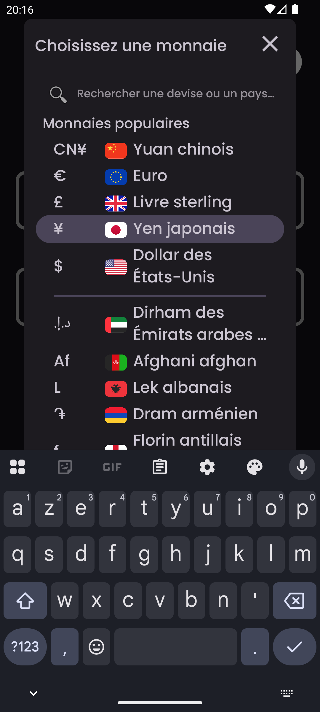
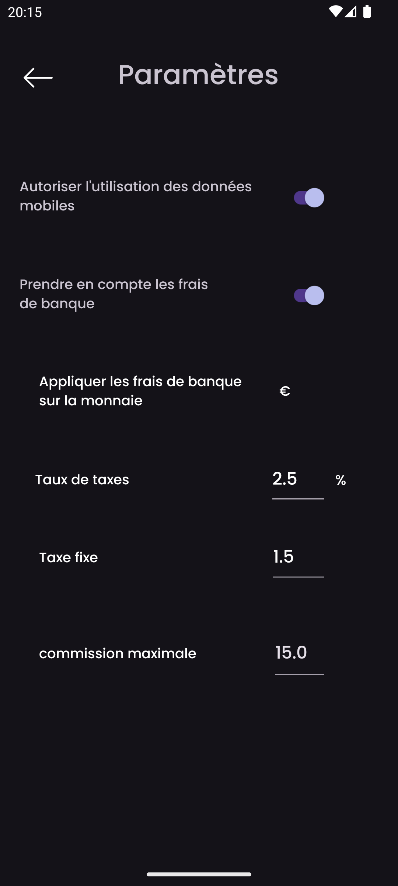
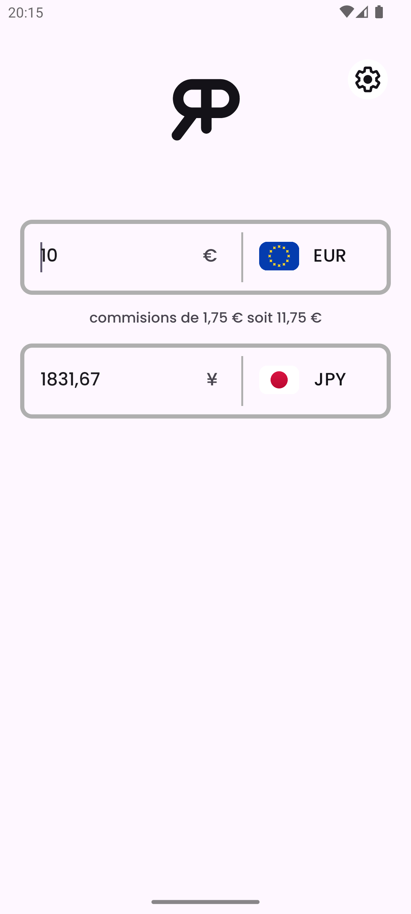

    

<h3 align="center">RealPrice</h3>

<i>par</i> <b><a href="https://github.com/MathieuMarthy">MathieuMarthy</a></b> <i>&</i> <b><a href="https://github.com/Game-K-Hack">Game K</a></b>

 

  
  
  

  <a href="#description">Description</a> •
  <a href="#comment-ça-marche-">Comment ça marche ?</a> •
  <a href="#paramétrage">Paramétrage</a>

 

    
    

 
 

    <b>:fr: Français</b> |
    <a href="../README.md">:uk: English</a> |
    <a href="./README.kr.md">:kr: 한국어</a> |
    <a href="./README.jp.md">:jp: 日本語</a> |
    <a href="./README.cn.md">:cn: 中文</a> |
    <a href="./README.it.md">:it: Italiano</a> |
    <a href="./README.es.md">:es: Español</a> |
    <a href="./README.ru.md">:ru: Русский</a> |
    <a href="./README.de.md">:de: Deutsch</a>

## Description

RealPrice est une application de conversion de devises destinée aux voyageurs qui souhaitent connaître le coût réel des articles dans une devise étrangère. Avec RealPrice, vous pouvez facilement comparer les taux de change entre deux devises et ajuster le pourcentage de commission prélevé par votre banque lors des transactions internationales. Cette fonctionnalité vous permet de calculer le prix final d'un article ou d'un service, en tenant compte non seulement du taux de change, mais aussi des frais bancaires associés. L'application se met automatiquement à jour dès que vous êtes connecté à Internet, garantissant des conversions toujours précises et à jour. Ne partez plus jamais en voyage sans RealPrice ! Assurez-vous de savoir exactement combien vous dépenserez dans votre devise de choix, en tenant compte des frais de conversion de votre banque. <a href="https://github.com/MathieuMarthy/RealPrice/releases/latest">Téléchargez RealPrice</a> dès aujourd'hui et voyagez en toute sérénité.
 
 
 

## 💡Comment ça marche ?

RealPrice fonctionne selon un principe simple mais efficace pour vous fournir des conversions de devises précises et réalistes :

### Conversion en temps réel
- L'application dispose de **plus de 200 devises mondiales** avec leurs taux de change actuels
- Les données de change se mettent à jour automatiquement dès que vous êtes connecté à Internet
- En mode hors ligne, l'application utilise les derniers taux téléchargés avec indication de la date de dernière mise à jour

### Interface
- **Deux champs de saisie** permettent une conversion instantanée dans les deux sens
- **Sélection facile des devises** via un menu déroulant avec drapeaux et symboles
- **Barre de recherche intelligente** : Trouvez instantanément les devises en tapant les codes (EUR,
  USD), les noms de devises (Euro, Dollar), ou les noms de pays (France, États-Unis). La recherche
  ignore les accents, donc taper "egypte" trouvera "Égypte"
- **Conversion bidirectionnelle** : tapez un montant dans n'importe quel champ pour voir la conversion automatique
- **Échange rapide** : si vous sélectionnez une devise déjà utilisée, les deux devises s'échangent automatiquement

### Autres fonctionnalités
- **Mode sombre/clair adaptatif**
- **Support multilingue** (9 langues disponibles)
 

  
  
  
  

 
 

## ⚙️ Paramétrage

Il existe plusieurs façons de configurer l'application RealPrice pour répondre à vos besoins spécifiques. Voici un guide détaillé des options disponibles :

### Gestion des données
Vous pouvez activer ou désactiver les mises à jour automatiques des taux de change via vos données mobiles. Désactivé par défaut pour économiser vos données.

### Configuration des frais bancaires
Activez cette option pour obtenir le coût réel de vos transactions internationales :

#### Paramètres des frais (actifs uniquement si les frais bancaires sont activés) :

- **Taux de commission (%)** : Pourcentage prélevé par votre banque sur chaque transaction
  - *Exemple : 2,5% signifie que pour un achat de 100€, vous paierez 2,50€ de commission*

- **Frais fixes** : Montant fixe ajouté à chaque transaction, quel que soit le montant converti
  - *Exemple : 1,50€ de frais fixes seront ajoutés à chaque paiement, que vous achetiez pour 10€ ou 1000€*

- **Devise d'application des frais** : Sélectionnez la devise dans laquelle votre banque facture les commissions
  - *Important : Les frais ne s'appliquent que lors de la conversion vers cette devise*

- **Commission maximale** : Plafond des frais bancaires (0 = pas de limite)
  - *Exemple : 15,00 pour limiter les frais à 15€ maximum par transaction*

### Comment configurer vos frais bancaires ?

1. Consultez les conditions tarifaires de votre banque pour les opérations à l'étranger
2. Activez **"Prendre en compte les frais bancaires"**
3. Saisissez le **taux de commission** (généralement entre 1% et 3%)
4. Ajoutez les **frais fixes** si votre banque les applique
5. Sélectionnez la **devise de facturation** (souvent votre devise locale)
6. Définissez un **plafond** si votre banque en propose un

### Devises par défaut 
L'application mémorise automatiquement vos deux dernières devises utilisées pour un accès rapide au prochain démarrage.

## Langues disponibles :

- :fr: Français
- :uk: English
- :kr: 한국어
- :jp: 日本語
- :cn: 中文
- :it: Italiano
- :es: Español
- :ru: Русский
- :de: Deutsch

_Si vous souhaitez que l'application soit traduite dans votre langue ou s'il y a un problème de traduction dans le README, faites-le nous savoir en laissant un <a href="https://github.com/MathieuMarthy/RealPrice/issues/1">message dans Issues</a>._
