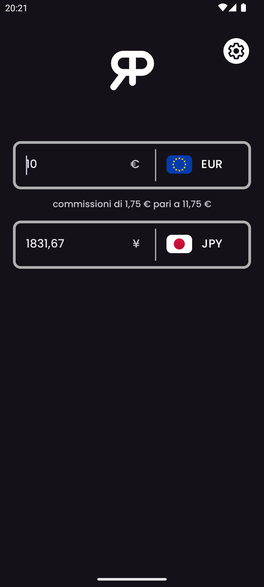
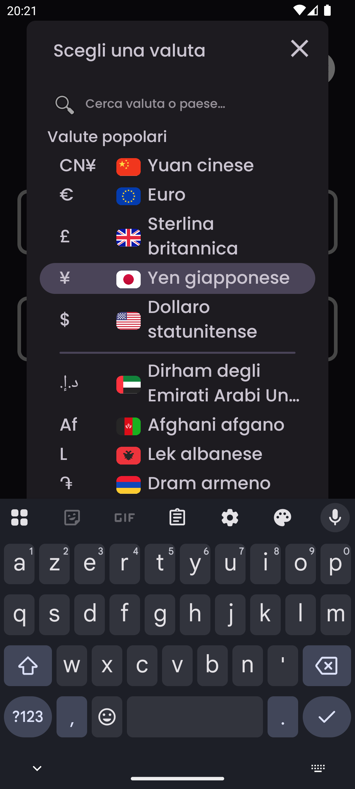
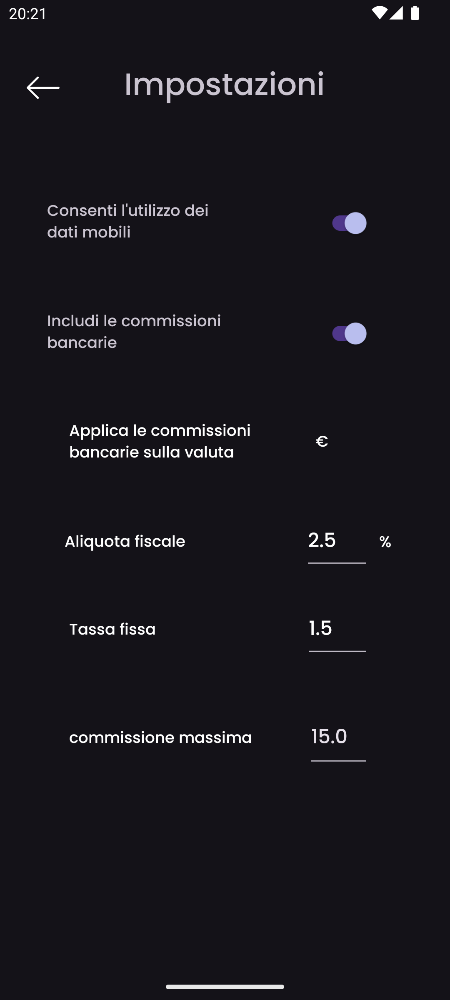
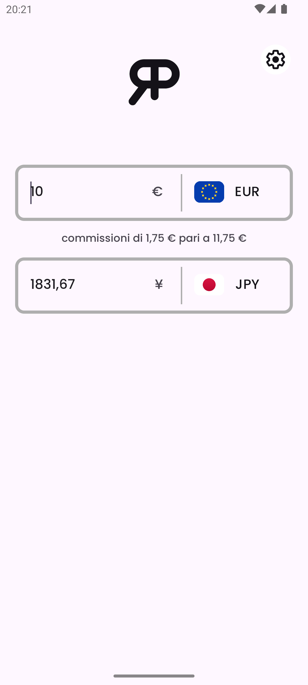

    

<h3 align="center">RealPrice</h3>

<i>di</i> <b><a href="https://github.com/MathieuMarthy">MathieuMarthy</a></b> <i>e</i> <b><a href="https://github.com/Game-K-Hack">Game K</a></b>

 

  
  
  

  <a href="#descrizione">Descrizione</a> •
  <a href="#come-funziona-">Come funziona ?</a> •
  <a href="#configurazione">Configurazione</a>

 

    
    

 
 

    <a href="./README.fr.md">:fr: Français</a> |
    <a href="../README.md">:uk: English</a> |
    <a href="./README.kr.md">:kr: 한국어</a> |
    <a href="./README.jp.md">:jp: 日本語</a> |
    <a href="./README.cn.md">:cn: 中文</a> |
    <b>:it: Italiano</b> |
    <a href="./README.es.md">:es: Español</a> |
    <a href="./README.ru.md">:ru: Русский</a> |
    <a href="./README.de.md">:de: Deutsch</a>

## Descrizione

RealPrice è un'app di conversione valuta per i viaggiatori che vogliono conoscere il costo reale degli articoli in una valuta straniera. Con RealPrice, puoi facilmente confrontare i tassi di cambio tra due valute e regolare la percentuale di commissione addebitata dalla tua banca durante le transazioni internazionali. Questa funzionalità ti consente di calcolare il prezzo finale di un articolo o servizio, tenendo conto non solo del tasso di cambio, ma anche delle commissioni bancarie associate. L'app si aggiorna automaticamente non appena sei connesso a Internet, garantendo conversioni sempre accurate e aggiornate. Non viaggiare mai più senza RealPrice! Assicurati di sapere esattamente quanto spenderai nella tua valuta di scelta, tenendo conto delle commissioni di conversione della tua banca. <a href="https://github.com/MathieuMarthy/RealPrice/releases/latest">Scarica RealPrice</a> oggi stesso e viaggia con tranquillità.
 
 
 

## 💡Come funziona ?

RealPrice opera secondo un principio semplice ma efficace per offrirti conversioni valutarie accurate e realistiche:

### Conversione in tempo reale
- L'app dispone di **oltre 200 valute globali** con i loro tassi di cambio attuali
- I dati di cambio si aggiornano automaticamente non appena sei connesso a Internet
- In modalità offline, l'app utilizza gli ultimi tassi scaricati con indicazione della data dell'ultimo aggiornamento

### Interfaccia
- **Due campi di input** consentono la conversione istantanea in entrambe le direzioni
- **Selezione facile delle valute** tramite un menu a discesa con bandiere e simboli
- **Barra di ricerca intelligente**: Trova valute istantaneamente digitando codici valuta (EUR,
  USD), nomi di valute (Euro, Dollaro), o nomi di paesi (Italia, Stati Uniti). La ricerca ignora gli
  accenti, quindi digitare "egitto" troverà "Egitto"
- **Conversione bidirezionale**: digita un importo in qualsiasi campo per vedere la conversione automatica
- **Scambio rapido**: se selezioni una valuta già in uso, le due valute si scambiano automaticamente

### Altre funzionalità
- **Modalità scuro/chiaro adattiva**
- **Supporto multilingue** (9 lingue disponibili)
 

  
  
  
  

 
 

## ⚙️ Configurazione

Ci sono diversi modi per configurare l'app RealPrice per soddisfare le tue esigenze specifiche. Ecco una guida dettagliata alle opzioni disponibili:

### Gestione dei dati
Puoi attivare o disattivare gli aggiornamenti automatici dei tassi di cambio tramite i tuoi dati mobili. Disabilitato per impostazione predefinita per risparmiare i tuoi dati.

### Configurazione delle commissioni bancarie
Attiva questa opzione per ottenere il costo reale delle tue transazioni internazionali:

#### Impostazioni delle commissioni (attive solo se le commissioni bancarie sono abilitate):

- **Tasso di commissione (%)**: Percentuale addebitata dalla tua banca per ogni transazione
  - *Esempio: 2,5% significa che per un acquisto di 100€, pagherai 2,50€ di commissione*

- **Commissioni fisse**: Importo fisso aggiunto a ogni transazione, indipendentemente dall'importo convertito
  - *Esempio: 1,50€ di commissioni fisse verranno aggiunte a ogni pagamento, che tu acquisti per 10€ o 1000€*

- **Valuta di applicazione delle commissioni**: Seleziona la valuta in cui la tua banca addebita le commissioni
  - *Importante: Le commissioni si applicano solo quando si converte in questa valuta*

- **Commissione massima**: Limite massimo per le commissioni bancarie (0 = nessun limite)
  - *Esempio: 15,00 per limitare le commissioni a un massimo di 15€ per transazione*

### Come configurare le tue commissioni bancarie?

1. Controlla le condizioni tariffarie della tua banca per le operazioni estere
2. Attiva **"Tieni conto delle commissioni bancarie"**
3. Inserisci il **tasso di commissione** (generalmente tra 1% e 3%)
4. Aggiungi le **commissioni fisse** se la tua banca le applica
5. Seleziona la **valuta di fatturazione** (spesso la tua valuta locale)
6. Imposta un **limite** se la tua banca ne offre uno

### Valute predefinite
L'app ricorda automaticamente le tue ultime due valute utilizzate per un accesso rapido al prossimo avvio.
- **Commissioni fisse** (importo fisso per transazione)
- **Commissione con limite massimo** (limite massimo delle commissioni)
- **Valuta di fatturazione** (scelta della valuta a cui si applicano le commissioni)

## Lingue disponibili:

- :fr: Français
- :uk: English
- :kr: 한국어
- :jp: 日本語
- :cn: 中文
- :it: Italiano
- :es: Español
- :ru: Русский
- :de: Deutsch

_Se vuoi che l'applicazione sia tradotta nella tua lingua o c'è un problema di traduzione nel README, faccelo sapere lasciando un <a href="https://github.com/MathieuMarthy/RealPrice/issues/1">messaggio nelle Issues</a>._
