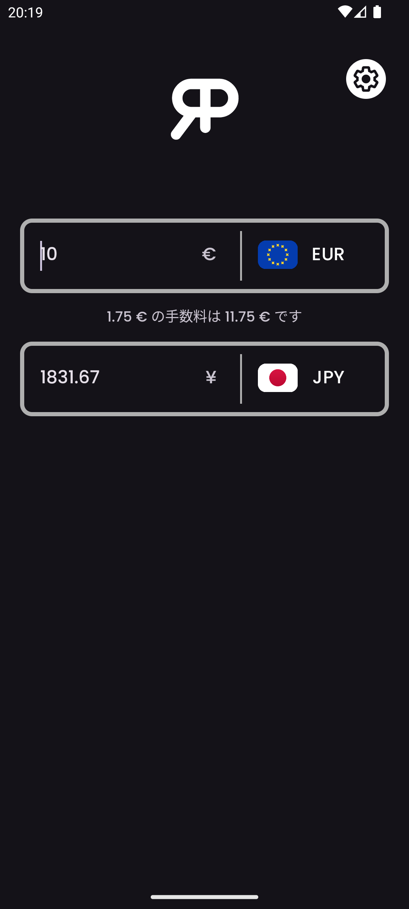
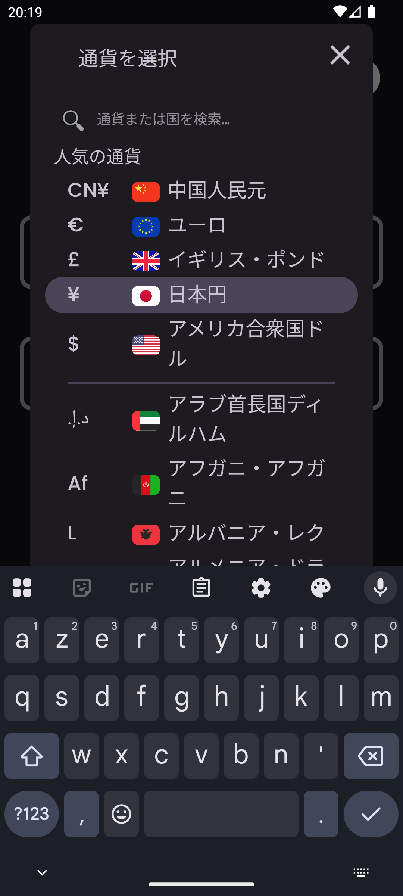
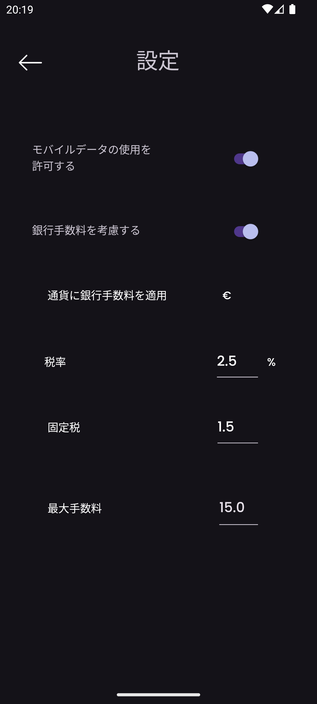

    

<h3 align="center">RealPrice</h3>

<i>by</i> <b><a href="https://github.com/MathieuMarthy">MathieuMarthy</a></b> <i>&</i> <b><a href="https://github.com/Game-K-Hack">Game K</a></b>

 

  
  
  

  <a href="#概要">概要</a> •
  <a href="#どのように動作しますか-">どのように動作しますか？</a> •
  <a href="#設定">設定</a>

 

    
    

 
 

    <a href="./README.fr.md">:fr: Français</a> |
    <a href="../README.md">:uk: English</a> |
    <a href="./README.kr.md">:kr: 한국어</a> |
    <b>:jp: 日本語</b> |
    <a href="./README.cn.md">:cn: 中文</a> |
    <a href="./README.it.md">:it: Italiano</a> |
    <a href="./README.es.md">:es: Español</a> |
    <a href="./README.ru.md">:ru: Русский</a> |
    <a href="./README.de.md">:de: Deutsch</a>

## 概要

RealPriceは、外国通貨での商品の実際のコストを知りたい旅行者のための通貨変換アプリです。RealPriceを使用すると、2つの通貨間の為替レートを簡単に比較し、国際取引時に銀行が徴収する手数料のパーセンテージを調整できます。この機能により、為替レートだけでなく、関連する銀行手数料も考慮して、商品やサービスの最終価格を計算できます。アプリはインターネットに接続されると自動的に更新され、常に正確で最新の変換を保証します。もうRealPriceなしで旅行しないでください！お選びの通貨で正確にいくら支出するかを確実に把握し、銀行の変換手数料を考慮してください。今すぐ<a href="https://github.com/MathieuMarthy/RealPrice/releases/latest">RealPriceをダウンロード</a>して、安心して旅行してください。
 
 
 

## 💡どのように動作しますか？

RealPriceは、正確でリアルな通貨変換を提供するため、シンプルで効果的な原理で動作します：

### リアルタイム変換
- アプリには現在の為替レートと共に**200以上のグローバル通貨**が含まれています
- インターネットに接続されると為替データが自動的に更新されます
- オフラインモードでは、アプリは最後のアップデート日を表示して最新のダウンロード済みレートを使用します

### インターフェース
- **2つの入力フィールド**により、両方向の即座の変換が可能です
- **フラグとシンボル付きドロップダウンメニュー**による簡単な通貨選択
- **スマート検索バー**
  ：通貨コード（EUR、USD）、通貨名（ユーロ、ドル）、または国名（日本、アメリカ合衆国）を入力して通貨を即座に検索できます。検索はアクセントを無視するため、「えじぷと」と入力しても「エジプト」が見つかります
- **双方向変換**：任意のフィールドに金額を入力して自動変換を確認
- **クイック交換**：既に使用中の通貨を選択すると、2つの通貨が自動的に交換されます

### その他の機能
- **適応型ダーク/ライトモード**
- **多言語サポート**（9言語対応）
 

  
  
  
  

 
 

## ⚙️ 設定

あなたの特定のニーズに合わせてRealPriceアプリを設定する方法はいくつかあります。利用可能なオプションの詳細ガイドは以下の通りです：

### データ管理
モバイルデータ経由での自動為替レート更新を有効または無効にできます。データを節約するためにデフォルトで無効になっています。

### 銀行手数料設定
国際取引の実際のコストを取得するにはこのオプションを有効にしてください：

#### 手数料設定（銀行手数料が有効な場合のみアクティブ）：

- **手数料率（%）**：各取引で銀行が請求するパーセンテージ
  - *例：2.5%は100€の購入で2.50€の手数料を支払うことを意味します*

- **固定手数料**：変換金額に関係なく各取引に追加される固定金額
  - *例：1.50€の固定手数料は、10€または1000€の購入に関係なく各支払いに追加されます*

- **手数料適用通貨**：銀行が手数料を請求する通貨を選択
  - *重要：手数料はこの通貨への変換時のみ適用されます*

- **最大手数料**：銀行手数料の上限（0 = 制限なし）
  - *例：15.00で手数料を取引あたり最大15€に制限*

### 銀行手数料の設定方法は？

1. 海外業務に関する銀行の料金条件を確認
2. **「銀行手数料を考慮する」**を有効にする
3. **手数料率**を入力（一般的に1%から3%の間）
4. 銀行が適用する場合は**固定手数料**を追加
5. **請求通貨**を選択（多くの場合、現地通貨）
6. 銀行が提供する場合は**上限**を設定

### デフォルト通貨
アプリは次回起動時の迅速なアクセスのために最後に使用した2つの通貨を自動的に記憶します。
- **固定手数料**（取引あたりの固定金額）
- **上限手数料**（手数料の最大限度額）
- **請求通貨**（手数料が適用される通貨の選択）

## 利用可能な言語:

- :fr: Français
- :uk: English
- :kr: 한국어
- :jp: 日本語
- :cn: 中文
- :it: Italiano
- :es: Español
- :ru: Русский
- :de: Deutsch

_アプリケーションをあなたの言語に翻訳してほしい場合、またはREADMEに翻訳の問題がある場合は、<a href="https://github.com/MathieuMarthy/RealPrice/issues/1">Issuesにメッセージ</a>を残してお知らせください。_
