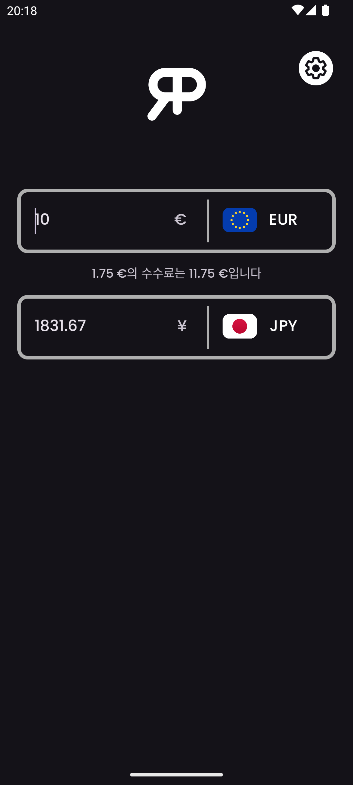
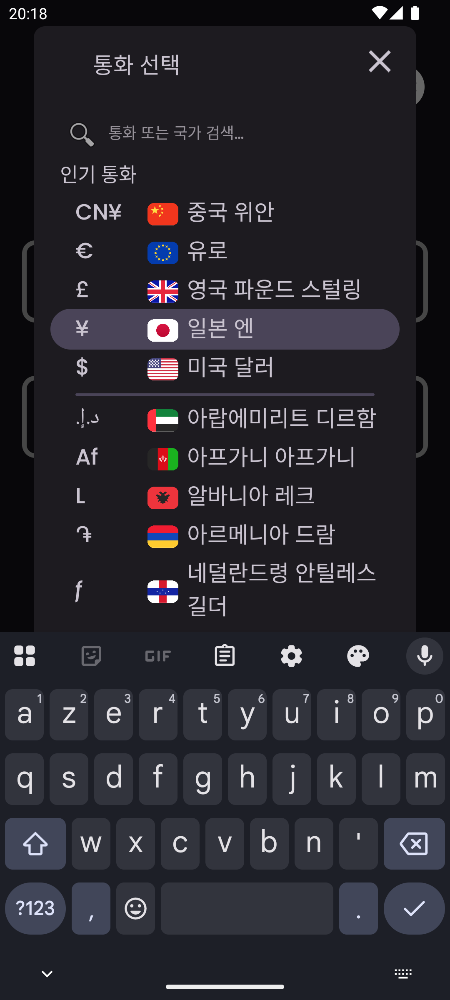
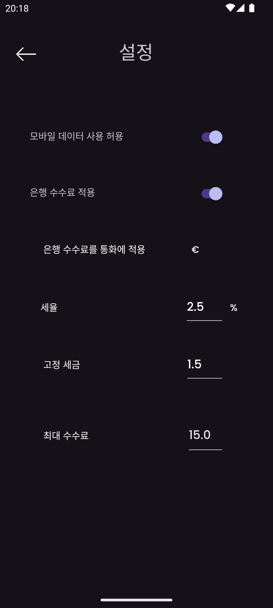
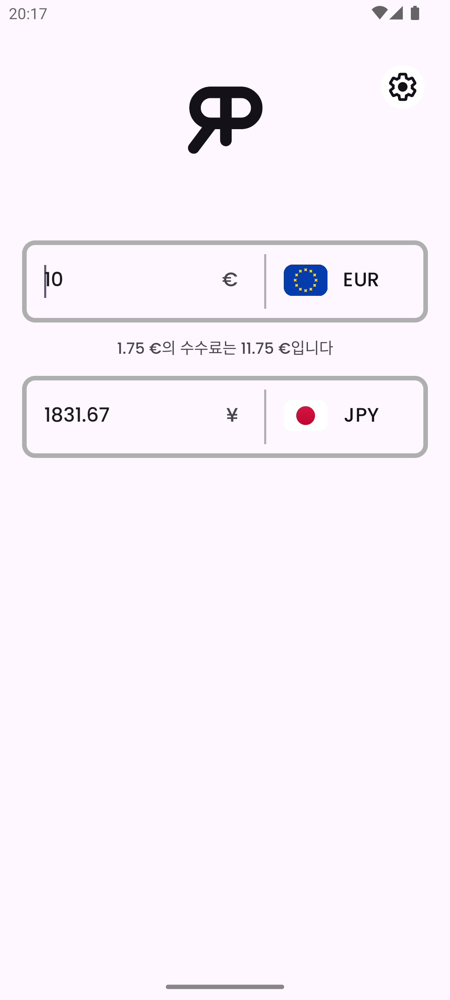

    

<h3 align="center">RealPrice</h3>

<i>by</i> <b><a href="https://github.com/MathieuMarthy">MathieuMarthy</a></b> <i>and</i> <b><a href="https://github.com/Game-K-Hack">Game K</a></b>

 

  
  
  

  <a href="#설명">설명</a> •
  <a href="#어떻게-작동하나요-">어떻게 작동하나요 ?</a> •
  <a href="#설정">설정</a>

 

    
    

 
 

    <a href="./README.fr.md">:fr: Français</a> |
    <a href="../README.md">:uk: English</a> |
    <b>:kr: 한국어</b> |
    <a href="./README.jp.md">:jp: 日本語</a> |
    <a href="./README.cn.md">:cn: 中文</a> |
    <a href="./README.it.md">:it: Italiano</a> |
    <a href="./README.es.md">:es: Español</a> |
    <a href="./README.ru.md">:ru: Русский</a> |
    <a href="./README.de.md">:de: Deutsch</a>

## 설명

RealPrice는 여행자들이 외화로 표시된 물건의 실제 비용을 알고 싶어하는 환율 변환 앱입니다. RealPrice를 사용하면 두 통화 간의 환율을 쉽게 비교하고 국제 거래 시 은행에서 부과하는 수수료 비율을 조정할 수 있습니다. 이 기능을 통해 환율뿐만 아니라 관련 은행 수수료까지 고려하여 상품이나 서비스의 최종 가격을 계산할 수 있습니다. 앱은 인터넷에 연결되면 자동으로 업데이트되어 항상 정확하고 최신의 환율 변환을 보장합니다. 더 이상 RealPrice 없이 여행하지 마세요! 은행의 환전 수수료를 고려하여 선택한 통화로 정확히 얼마를 지출할지 확실히 알 수 있습니다. <a href="https://github.com/MathieuMarthy/RealPrice/releases/latest">RealPrice를 다운로드</a>하고 안심하고 여행하세요.
 
 
 

## 💡어떻게 작동하나요 ?

RealPrice는 정확하고 현실적인 환율 변환을 제공하기 위해 간단하면서도 효과적인 원리로 작동합니다:

### 실시간 변환
- 앱은 현재 환율과 함께 **200개 이상의 글로벌 통화**를 제공합니다
- 인터넷에 연결되는 즉시 환율 데이터가 자동으로 업데이트됩니다
- 오프라인 모드에서는 마지막 업데이트 날짜 표시와 함께 최신 다운로드된 환율을 사용합니다

### 인터페이스
- **두 개의 입력 필드**를 통해 양방향으로 즉시 변환할 수 있습니다
- 플래그와 기호가 있는 드롭다운 메뉴를 통한 **쉬운 통화 선택**
- **스마트 검색 바**: 통화 코드(EUR, USD), 통화 이름(유로, 달러), 또는 국가 이름(대한민국, 미국)을 입력하여 즉시 통화를 찾을 수 있습니다. 검색은 악센트를
  무시하므로 "이집트"를 입력해도 "이집트"를 찾을 수 있습니다
- **양방향 변환**: 어느 필드에나 금액을 입력하면 자동 변환을 볼 수 있습니다
- **빠른 교환**: 이미 사용 중인 통화를 선택하면 두 통화가 자동으로 교환됩니다

### 기타 기능
- **적응형 다크/라이트 모드**
- **다국어 지원** (9개 언어 지원)
 

  
  
  
  

 
 

## ⚙️ 설정

귀하의 특정 요구사항에 맞게 RealPrice 앱을 구성하는 여러 가지 방법이 있습니다. 사용 가능한 옵션에 대한 자세한 가이드는 다음과 같습니다:

### 데이터 관리
모바일 데이터를 통한 자동 환율 업데이트를 활성화하거나 비활성화할 수 있습니다. 데이터를 절약하기 위해 기본적으로 비활성화되어 있습니다.

### 은행 수수료 구성
국제 거래의 실제 비용을 얻으려면 이 옵션을 활성화하세요:

#### 수수료 설정 (은행 수수료가 활성화된 경우에만 활성화):

- **수수료율 (%)**: 각 거래에서 은행이 부과하는 백분율
  - *예시: 2.5%는 100€ 구매시 2.50€의 수수료를 지불한다는 의미입니다*

- **고정 수수료**: 변환 금액에 관계없이 각 거래에 추가되는 고정 금액
  - *예시: 1.50€의 고정 수수료는 10€든 1000€든 각 결제에 추가됩니다*

- **수수료 적용 통화**: 은행이 수수료를 부과하는 통화를 선택
  - *중요: 수수료는 이 통화로 변환할 때만 적용됩니다*

- **최대 수수료**: 은행 수수료 한도 (0 = 제한 없음)
  - *예시: 15.00으로 거래당 최대 15€로 수수료를 제한*

### 은행 수수료를 구성하는 방법은?

1. 해외 업무에 대한 은행의 요금 조건을 확인하세요
2. **"은행 수수료 고려"**를 활성화하세요
3. **수수료율**을 입력하세요 (일반적으로 1%에서 3% 사이)
4. 은행이 적용하는 경우 **고정 수수료**를 추가하세요
5. **청구 통화**를 선택하세요 (종종 현지 통화)
6. 은행이 제공하는 경우 **한도**를 설정하세요

### 기본 통화
앱은 다음 시작 시 빠른 액세스를 위해 마지막으로 사용한 두 통화를 자동으로 기억합니다.

## 사용 가능한 언어:

- :fr: Français
- :uk: English
- :kr: 한국어
- :jp: 日本語
- :cn: 中文
- :it: Italiano
- :es: Español
- :ru: Русский
- :de: Deutsch

_앱이 귀하의 언어로 번역되기를 원하거나 README에 번역 문제가 있다면 <a href="https://github.com/MathieuMarthy/RealPrice/issues/1">Issues에 메시지</a>를 남겨 알려주세요._
