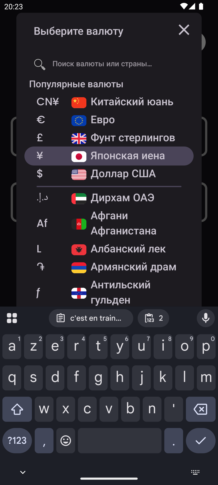
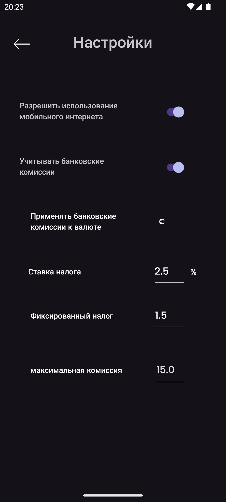
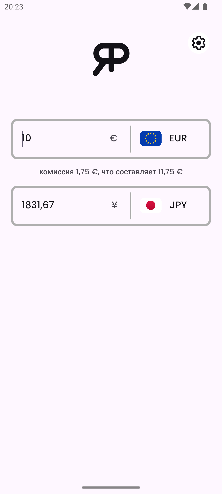

    

<h3 align="center">RealPrice</h3>

<i>от</i> <b><a href="https://github.com/MathieuMarthy">MathieuMarthy</a></b> <i>и</i> <b><a href="https://github.com/Game-K-Hack">Game K</a></b>

 

  
  
  

  <a href="#описание">Описание</a> •
  <a href="#как-это-работает-">Как это работает ?</a> •
  <a href="#конфигурация">Конфигурация</a>

 

    
    

 
 

    <a href="./README.fr.md">:fr: Français</a> |
    <a href="../README.md">:uk: English</a> |
    <a href="./README.kr.md">:kr: 한국어</a> |
    <a href="./README.jp.md">:jp: 日本語</a> |
    <a href="./README.cn.md">:cn: 中文</a> |
    <a href="./README.it.md">:it: Italiano</a> |
    <a href="./README.es.md">:es: Español</a> |
    <b>:ru: Русский</b> |
    <a href="./README.de.md">:de: Deutsch</a>

## Описание

RealPrice - это приложение для конвертации валют для путешественников, которые хотят знать реальную стоимость товаров в иностранной валюте. С RealPrice вы можете легко сравнивать обменные курсы между двумя валютами и корректировать процент комиссии, взимаемой вашим банком при международных транзакциях. Эта функция позволяет рассчитать окончательную цену товара или услуги, учитывая не только обменный курс, но и связанные банковские комиссии. Приложение автоматически обновляется, как только вы подключаетесь к Интернету, обеспечивая всегда точные и актуальные конвертации. Никогда больше не путешествуйте без RealPrice! Будьте уверены, что точно знаете, сколько потратите в выбранной валюте, учитывая комиссии за конвертацию вашего банка. <a href="https://github.com/MathieuMarthy/RealPrice/releases/latest">Скачайте RealPrice</a> сегодня и путешествуйте с уверенностью.
 
 
 

## 💡Как это работает ?

RealPrice работает по простому, но эффективному принципу, обеспечивая точные и реалистичные конвертации валют:

### Конвертация в реальном времени
- Приложение включает **более 200 мировых валют** с их текущими обменными курсами
- Данные о курсах автоматически обновляются при подключении к Интернету
- В автономном режиме приложение использует последние загруженные курсы с указанием даты последнего обновления

### Интерфейс
- **Два поля ввода** позволяют мгновенную конвертацию в обе стороны
- **Легкий выбор валют** через выпадающее меню с флагами и символами
- **Умная строка поиска**: Находите валюты мгновенно, вводя коды валют (EUR, USD), названия валют (
  Евро, Доллар), или названия стран (Россия, США). Поиск игнорирует диакритические знаки, поэтому
  ввод "египет" найдет "Египет"
- **Двунаправленная конвертация**: введите сумму в любое поле для автоматической конвертации
- **Быстрый обмен**: при выборе уже используемой валюты две валюты автоматически меняются местами

### Другие функции
- **Адаптивный темный/светлый режим**
- **Многоязычная поддержка** (доступно 9 языков)
 

  
  
  
  

 
 

## ⚙️ Конфигурация

Существует несколько способов настройки приложения RealPrice в соответствии с вашими конкретными потребностями. Вот подробное руководство по доступным опциям:

### Управление данными
Вы можете включить или отключить автоматические обновления обменных курсов через ваши мобильные данные. По умолчанию отключено для экономии ваших данных.

### Конфигурация банковских комиссий
Включите эту опцию, чтобы получить реальную стоимость ваших международных транзакций:

#### Настройки комиссий (активны только при включенных банковских комиссиях):

- **Комиссионная ставка (%)**: Процент, взимаемый вашим банком за каждую транзакцию
  - *Пример: 2,5% означает, что за покупку на 100€ вы заплатите 2,50€ комиссии*

- **Фиксированные комиссии**: Фиксированная сумма, добавляемая к каждой транзакции, независимо от конвертируемой суммы
  - *Пример: 1,50€ фиксированных комиссий будут добавлены к каждому платежу, покупаете ли вы на 10€ или 1000€*

- **Валюта применения комиссий**: Выберите валюту, в которой ваш банк взимает комиссии
  - *Важно: Комиссии применяются только при конвертации в эту валюту*

- **Максимальная комиссия**: Лимит банковских комиссий (0 = без ограничений)
  - *Пример: 15,00 для ограничения комиссий максимум в 15€ за транзакцию*

### Как настроить ваши банковские комиссии?

1. Проверьте тарифные условия вашего банка для зарубежных операций
2. Включите **"Учитывать банковские комиссии"**
3. Введите **комиссионную ставку** (обычно от 1% до 3%)
4. Добавьте **фиксированные комиссии**, если ваш банк их применяет
5. Выберите **валюту выставления счетов** (часто вашу местную валюту)
6. Установите **лимит**, если ваш банк его предоставляет

### Валюты по умолчанию
Приложение автоматически запоминает ваши последние две используемые валюты для быстрого доступа при следующем запуске.

## Доступные языки:

- :fr: Français
- :uk: English
- :kr: 한국어
- :jp: 日本語
- :cn: 中文
- :it: Italiano
- :es: Español
- :ru: Русский
- :de: Deutsch

_Если вы хотите, чтобы приложение было переведено на ваш язык или есть проблема с переводом в README, дайте нам знать, оставив <a href="https://github.com/MathieuMarthy/RealPrice/issues/1">сообщение в Issues</a>._
